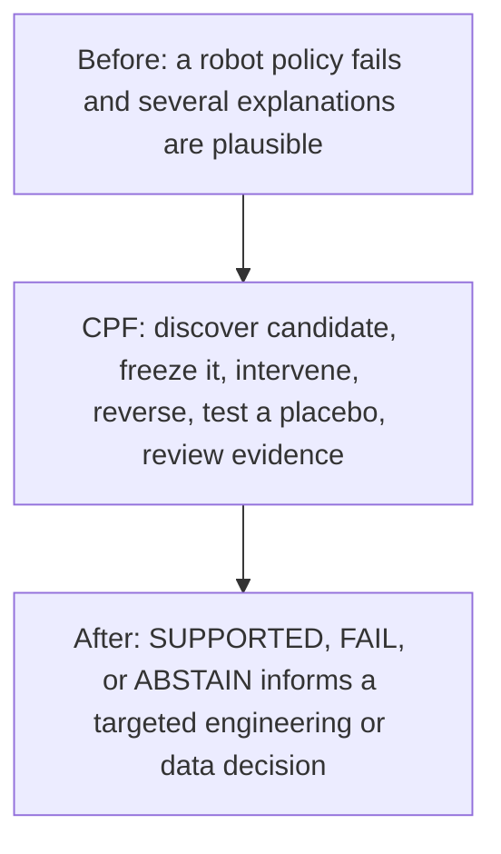

# EthSeq CPF

**Controlled failure attribution for robot policies.**

CPF tests whether a suspected factor actually causes a robot-policy failure through controlled interventions.

**What CPF answers:** “Did this factor actually cause the failure?”

**What CPF does not claim:** “CPF does not currently automate policy repair.”

[Website](https://ethseq.com/) · [How CPF works](docs/how-cpf-works.md) · [Evidence](docs/evidence.md) · [Practical workflow](docs/practical-workflow.md) · [Research boundaries](docs/research-boundaries.md) · [Collaboration](docs/collaboration.md)

---

## The problem

When a robot policy fails, a team can often name several plausible explanations. The hard part is determining whether one of those factors actually caused the failure.

Correlation, saliency, visualization, and post-hoc explanation can help form a hypothesis. By themselves, they do not establish causation. CPF is designed to turn a concrete candidate into a controlled test.

## Before, CPF, and the decision after

The outcome is a more defensible diagnostic decision. It is **not** an automatic performance improvement claim.

## How CPF works

CPF follows a bounded evidence workflow:

1. **Failure** — Start from an observed robot-policy failure.
2. **Define a bounded, testable space** — Humans define the intervenable search space; they do not supply the final answer.
3. **Candidate discovery** — CPF discovers and scores concrete candidates within that space.
4. **Candidate freeze** — The selected candidate is frozen before the final experiment.
5. **Controlled intervention** — Test the candidate, reverse it, and compare with unrelated controls.
6. **Evidence decision** — Report **SUPPORTED**, **FAIL**, or **ABSTAIN**.

In plain language: humans tell CPF where it is allowed to look. CPF finds the specific suspicious factor. Then it changes that factor, changes it back, and tests unrelated controls to determine whether the factor actually changes policy behavior.

A candidate score is not a causal conclusion. Final attribution is based on controlled intervention evidence, not on the discovery score. See [How CPF works](docs/how-cpf-works.md).

## Evidence at a glance

The following is internal experimental evidence from the PushCube H3 task. It is not independent external validation.

| PushCube H3 condition | Successful episodes |
| --- | ---: |
| Noop | 20 / 20 |
| Forward intervention | 0 / 20 |
| Placebo | 20 / 20 |
| Full Failure | 0 / 20 |
| Reverse intervention | 20 / 20 |

Within this bounded setup, changing only the frozen CPF candidate turned successful episodes into failures; restoring that candidate in the failure state restored successful behavior; an unrelated placebo did not change the result.

CPF has also completed blind bidirectional controlled-intervention attribution on **PickCube**, a second independent task. This establishes internal evidence that the controlled-attribution workflow can be repeated across two tasks; it does not complete external independent validation. Details and input restrictions are in [Evidence](docs/evidence.md).

## What CPF has not proven

CPF has **not** proven:

- automated policy repair;
- automatic performance improvement;
- universal causal understanding;
- general world-model reasoning; or
- automatic training-data generation.

A CPF-guided repair comparison was conducted, but it did not demonstrate a CPF-guided advantage over the evaluated baselines. EthSeq therefore does not claim automated repair. When evidence is insufficient, CPF should **ABSTAIN** rather than force a cause.

External independent validation is not yet completed.

## Why this matters to robot teams

Robot teams often know that a policy failed. The more useful next question is whether a suspected factor actually caused that failure.

If attribution is supported, a team has a testable basis for deciding whether to collect targeted data, change a model, adjust perception, or modify another part of the system. If it fails, or evidence is insufficient, that is useful too: the team avoids treating a plausible explanation as a confirmed cause.

## What this could look like in a real workflow

EthSeq is planning external validation workflows such as a ski / 3D-perception case: a system works on some samples and fails on others, and CPF tests whether a specific occlusion pattern is actually responsible. If that attribution is supported, the team may choose to collect targeted examples and run a controlled retraining experiment, evaluated on an untouched held-out test set.

This is an illustrative planned external workflow, **not** a completed result or a claim of metric improvement. Read the full example in [Practical workflow](docs/practical-workflow.md).

## Product direction: EthSeq CPF Workbench

EthSeq CPF Workbench is the product direction for organizing a customer attribution workflow. Teams are expected to be able to bring:

- failure episodes;
- evidence;
- a policy or callable model interface; and
- an intervention interface.

The Workbench direction is to organize the attribution workflow, Runner, and CPF evidence around those inputs. It does not imply that every connector or workflow is already fully automated.

## Collaboration

We are looking for:

- robot manipulation teams;
- embodied AI and VLA teams;
- policy-evaluation researchers;
- teams with reproducible policy failures; and
- external validation partners.

Collaboration is designed to run attribution validation in a partner’s own task, model, data, and environment. The outcome can be **PASS**, **FAIL**, or **ABSTAIN**; a partner is not asked to prove that EthSeq must work. See [Collaboration](docs/collaboration.md) or visit [ethseq.com](https://ethseq.com/).

## Repository scope

This repository is a public technical overview. It intentionally excludes proprietary implementation and non-public research or customer artifacts.

© EthSeq. All rights reserved.
