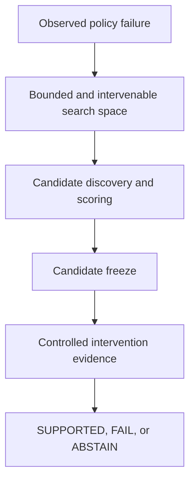

# How CPF works

## The question

The Causal Perturbation Framework (CPF) addresses one specific question:

> After a robot policy has failed, did a candidate factor actually cause that failure?

CPF is a framework for **robot-policy failure attribution**. It is not a general causal model of the world, a general-purpose world model, or a policy-repair system.

## The workflow

### 1. Start from a failure

CPF begins after a robot policy has already failed. The failure provides the episode and behavior that need explanation.

### 2. Define a bounded, intervenable search space

Humans define the part of the system CPF is allowed to inspect and perturb. This makes the question concrete and testable. It does **not** mean a person preselects the answer.

The search space must be both bounded and intervenable: a candidate has to be expressible in a way that can be changed under a controlled comparison.

### 3. Discover concrete candidates

Within the allowed search space, CPF can discover and score concrete candidates. Discovery inputs are specified in advance for the task. A candidate score helps decide what to test; it is not attribution evidence.

### 4. Freeze the candidate

The candidate is frozen before the final controlled experiment. It cannot be replaced because a later result is inconvenient. This separation prevents the final test from being chosen after seeing its outcome.

### 5. Run controlled interventions

The final question is answered by interventions, not by the candidate score alone. Depending on the task, the controlled comparison can include:

- **Forward intervention:** change the frozen candidate in a successful condition and test whether policy behavior changes.
- **Reverse intervention:** restore the frozen candidate in a failure condition and test whether policy behavior changes back.
- **Placebo control:** change an unrelated factor to test whether the effect is specific to the candidate.

The exact intervention is task-specific. The principle is to isolate a defined factor while keeping the comparison controlled.

### 6. Make an evidence decision

CPF reports one of three outcomes:

| Outcome | Meaning |
| --- | --- |
| **SUPPORTED** | The controlled evidence supports attribution to the frozen candidate within the defined setup. |
| **FAIL** | The controlled test did not support that attribution in the defined setup. |
| **ABSTAIN** | The evidence is insufficient to make a reliable attribution. |

`FAIL` does not mean a factor can never matter in any context. It means the tested evidence did not support the attribution. `ABSTAIN` is a deliberate result, not a fallback for a forced explanation.

## What CPF is not

CPF is not a process in which an engineer guesses the cause and the framework merely confirms it. Humans specify the bounded search space; CPF discovers concrete candidates inside it; the candidate is frozen; and controlled intervention evidence determines the final attribution decision.

CPF also does not claim to automatically choose a remediation. Once an attribution is supported, a team may decide to add data, change a model, adjust a system component, or test another hypothesis. That decision remains outside the attribution result itself.

See [Evidence](evidence.md) for the reported internal experiments and [Research boundaries](research-boundaries.md) for the limits of the current claims.
